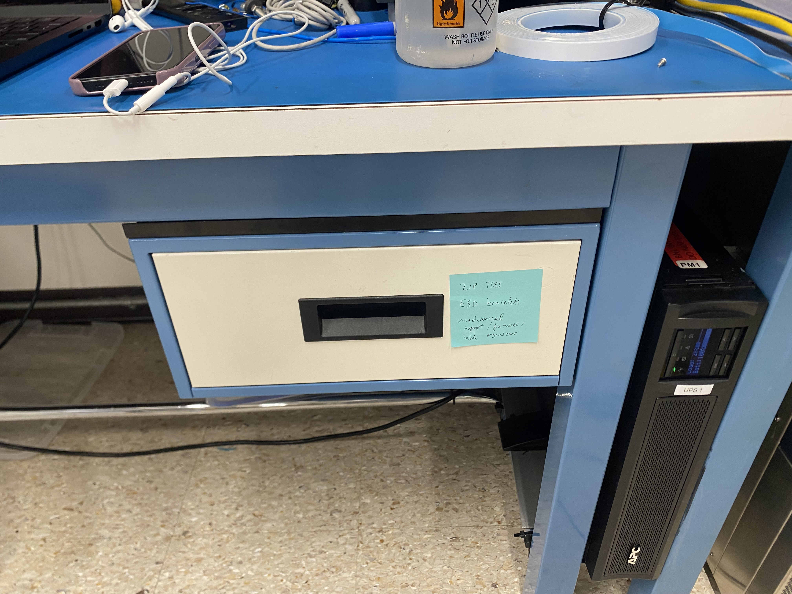
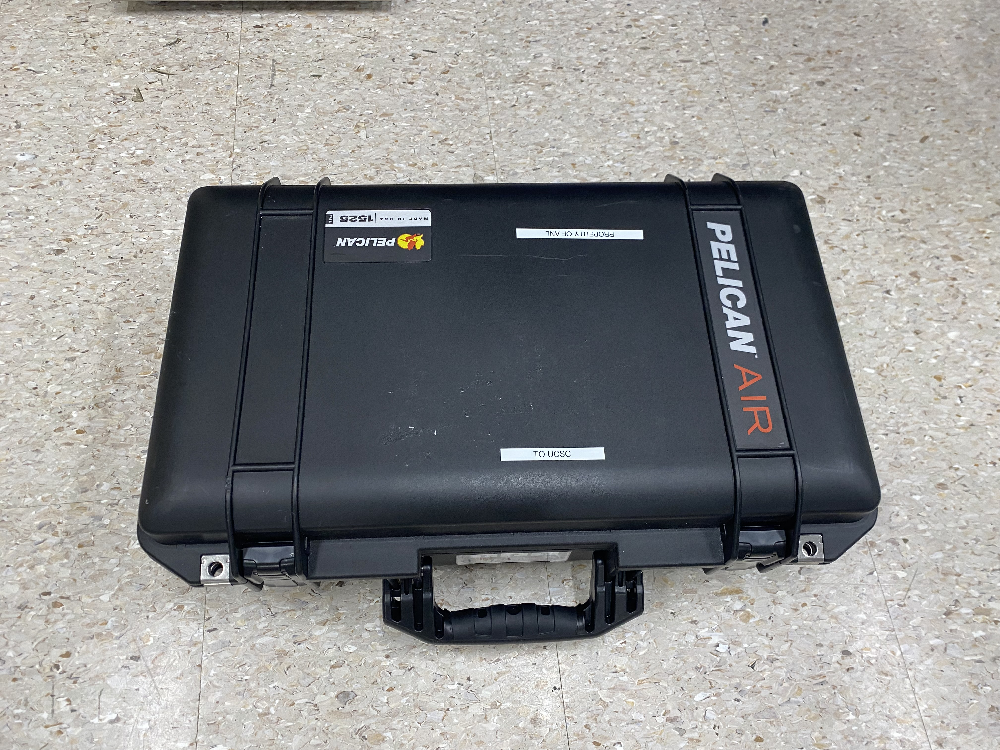
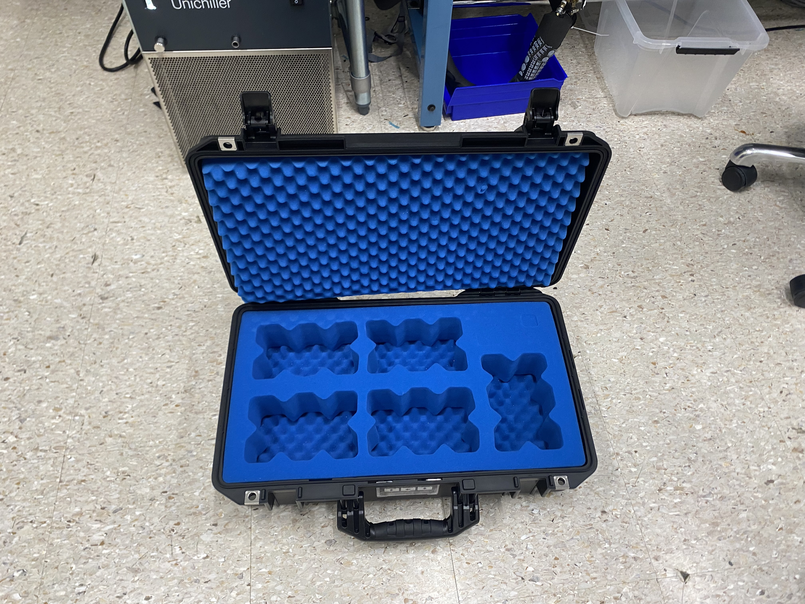
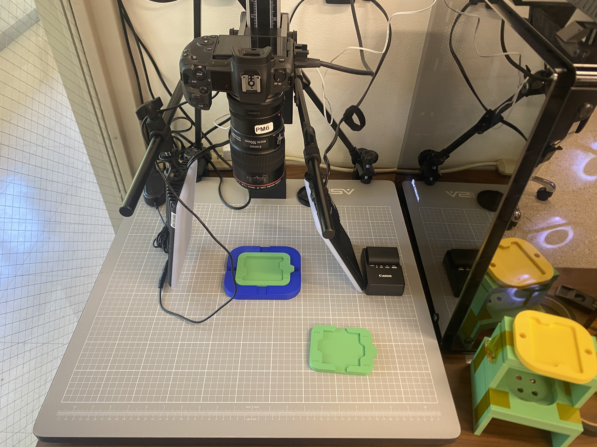
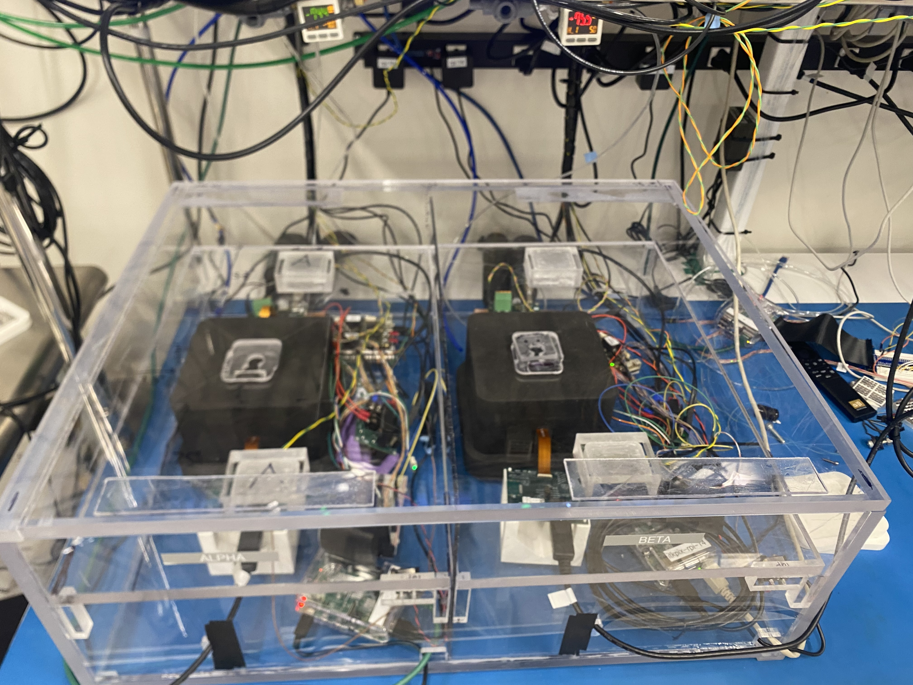
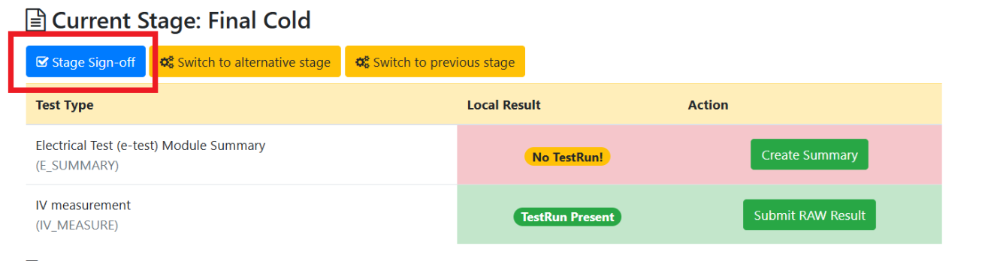

---
author:
- SCIPP Modules
title: Pixel Module Testing
---

This guide outlines the reception, inspection, handling, and testing procedures used for pixel modules at SCIPP. It is intended for internal use by the SCIPP modules team to ensure safe and standardized testing protocols. This document is version controlled and exists in the

# Module Reception {#sec:recieve}

Before anything is done, the module information must be pulled from the production database into the local database. This will need to be done by a grad student or postdoc that has access to the production database.

Module reception will require the following PPE to be work on top of the standard cleanroom PPE.

-   ESD Bracelet

-   Gloves

The ESD bracelet and cord can be found in the drawer shown in Fig [1](#fig:ESD-Drawer){reference-type="ref" reference="fig:ESD-Drawer"}. The bracelet must be touching skin when worn and plugged into the green plug on the bottom side of the lab bench table, an example of this is shown in Fig [2](#fig:esd-example){reference-type="ref" reference="fig:esd-example"}.

{#fig:ESD-Drawer width="0.5\\linewidth"}

{#fig:esd-example width="0.5\\linewidth"}

The module should come in a pelican case shown closed in Fig [3](#fig:pelican-closed){reference-type="ref" reference="fig:pelican-closed"} and open in Fig [4](#fig:pelican-open){reference-type="ref" reference="fig:pelican-open"}.

{#fig:pelican-closed width="0.5\\linewidth"}

{#fig:pelican-open width="0.5\\linewidth"}

There can be multiple modules in a single delivery and the next steps will be repeated for each module.

## Reception Checklist

-   Check [localdb](#https://itkpix-srv.ucsc.edu/localdb/components?view=module). for module, if it is not there, ask an expert to pull from ITkPD.

-   Cut electrostatic discharge (ESD) bag and check that the module matches the serial number put in dry air cabinet

-   Check in local db that the current stage of the module is MODULE/POST_PARYLENE_WARM, if it is not then contact an expert.

# Visual Inspection {#sec:vis-inspect}

The purpose of the visual inspection is to ensure that the chip is not damaged. Visual inspection will require the following PPE to be worn on top of the standard cleanroom PPE.

-   ESD Bracelet

-   Gloves

In Fig [5](#fig:visinspect){reference-type="ref" reference="fig:visinspect"} the setup we have for visual inspection. The green plastic holder under the camera is used to hold the module when inspecting it.

{#fig:visinspect width="0.5\\linewidth"}

-   Take the module out of the dry air cabinet in the received section.

-   Carefully take the cover off the top of the module by unscrewing the screws that hold down the plastic cover, placing the cover upside down so that the foam pieces are not in contact with anything and then placing the module inside the green 3d printed carrier used for imaging the front side, this can be seen in Fig [6](#fig:front-side){reference-type="ref" reference="fig:front-side"}.

    {#fig:front-side width="0.5\\linewidth"}

-   Once in the carrier and set below the camera inside of the blue carrier holder. Make sure that the orientaton of the chips is the same as in Fig [6](#fig:front-side){reference-type="ref" reference="fig:front-side"} with GA1 at the top left.

-   Turn the camera on by switching the camera to on at the top of it. Turn the lights on by flipping their switches that are on the wall.

-   on daq05 terminal run the following script in the monitoring/visual_inspection folder. This will open a graphic user interface that you will use to capure images of the module.

        venv/bin/python get_image.py

-   Change the focus on the camera and in the visual inspection user interface change the zoom to make sure that the wirebonds are in focus when zoomed in.

    Note that the script that is ran is a non electric test and more information about submitting non-electrical QC tests of ITkPix modules can be found in the [module-qc-non-elec-gui documentation](https://pypi.org/project/module-qc-nonelec-gui/).

-   Add the module ID and select front side of the module and capture the image by hitting the button in user interface.

-   Carefully place the module cover back on and screw in the holding screws.

-   Take the module out of the front side carrier and take the backside cover screws off.

-   Carefully lift the module off of the base plate and place upside down inside of the green holder shown in Fig [7](#fig:back-side){reference-type="ref" reference="fig:back-side"}.

    {#fig:back-side width="0.5\\linewidth"}

-   Turn the camera on and then off again.

-   Change the focus on the camera and in the visual inspection user interface change the zoom to make sure that the wirebonds are in focus when zoomed in.

-   Select back side and capture the image.

-   Place the module back onto the base plate and screw it in.

-   Turn the camera and lights off and then place the module in the dry air cabinet in the visual inspection shelf.

# Placing Module into Enclosure {#sec:enclosure}

**PPE REQUIRED**

-   ESD Bracelet

-   Gloves

Before starting this process, make sure no on else is using setup that you are trying to use.

{#fig:enclosure width="0.5\\linewidth"}

Take the module outside of the visual inspection area of the dry air cabinet. If it is in the received and not in the visual inspection then it may not have been visually inspected yet or placed in the wrong part of the dry air cabinet.

-   Take off the level one and level two lids and remove the lid to the foam box.

-   Use a small amount of isopropyl alcohol (IPA) on a cotton tipped applicators that you can find by the sink to wipe down the vacuum chuck.

-   Take the base plate off of the module and place it on the vacuum chuck, make sure there is full contact between the chuck and module and make sure that it is oriented correctly so that the pigtails can be plugged in, see Fig [11](#fig:module-in-foam){reference-type="ref" reference="fig:module-in-foam"}.

-   Push down on the center of the module and simultaneously turn on the vacuum and make sure the pressure is above 70 kPa. The vacuum is off when the vacuum valve is faced toward you as seen in Fig [9](#fig:vac-closed){reference-type="ref" reference="fig:vac-closed"} and the vacuum is on when it is faced away from you as seen in Fig [10](#fig:vac-open){reference-type="ref" reference="fig:vac-open"}.

    {#fig:vac-closed width="0.5\\linewidth"}

    {#fig:vac-open width="0.5\\linewidth"}

-   Plug the module pigtails into the data adapter card and power adapter card.

-   Make sure dry air tube is inside the foam and place the foam lid back on

    {#fig:module-in-foam width="0.5\\linewidth"}

-   Make sure the dry air to the enclosure is on, one going directly to the module into the foam box and one going inside of the enclosure. To make sure the dry air is on, check that the dry air gauges shown in Fig [12](#fig:dry-air){reference-type="ref" reference="fig:dry-air"} have a ball that is floating. If it does not you can adjust the dry air flow using the valve dial that is circled in Fig [12](#fig:dry-air){reference-type="ref" reference="fig:dry-air"}.

    {#fig:dry-air width="0.5\\linewidth"}

-   Make sure all the cabling for breadboards/PCBs and power are plugged in and there are no loose wires, if something is unplugged contact an expert.

-   Check on grafana for the correct setup that the NTC of the module is being properly read out.

    This can be done by taking out the pins next to R1 on the power adapter card (PAC) and putting a resistor into these pin holes. You will see on grafana that the module temperature will change to an unreasonable number and this confirms that the temperature is begin read correctly. In Fig [13](#fig:PAC){reference-type="ref" reference="fig:PAC"} the braided multicolor wires are plugged into the pins mentioned above.

    {#fig:PAC width="0.5\\linewidth"}

-   Place the level 2 lid back on, reset the hardware interlock and then place the level 1 lid on. At this point you can take off gloves and ESD Bracelet.

-   Check to make sure valves are open to cool the correct enclosure(s). A valve on the chiller line is closed if it is perpendicular to the chiller line and it is open if it is parallel to the chiller line. An example of this can be seen in Fig [14](#fig:chillervalves){reference-type="ref" reference="fig:chillervalves"}.

    {#fig:chillervalves width="0.5\\linewidth"}

    It is important to make sure that if a chiller line is open, both valves are open to that line, if one valve is open and one valve is closed on the same line, the chiller line will break and leak ethylene glycol (anti freeze) onto the floor when the chiller is ran.

# Checking Module Connectivity

Turn the chiller on using the script found in Table [4](#tab:commands){reference-type="ref" reference="tab:commands"}. Make sure that the interlock and meerstetter are both good and ready. You can check this in grafana, it should be open on the TV above the stand you are working with but if it is not it can be accessed at [ITk Pixel Stand Monitoring](https://itkpix-srv.ucsc.edu/grafana/d/adsk2cnkdnda8b/itk-pixel-stand-monitoring?orgId=1&from=now-30m&to=now&timezone=browser&var-stand=ice-king&refresh=5s).

We can pull the chip configuration files from localdb using the following script on daq-05. The correct DAQ cable and stand mapping can be found in Table [1](#tab:daqmap){reference-type="ref" reference="tab:daqmap"}.

::: {#tab:daqmap}
    Stand    DAQ Cable
  --------- -----------
    Alpha        A
    Beta         B
    Delta        C
   Epsilon       D

  : Mapping of DAQ cable to their stand
:::

    mqdbt generate-yarr-config --sn [SN] --port [DAQ Cable] 
    --uri mongodb://itkpix-srv.ucsc.edu:27017/localdb?ssl=True 
    --localdb --outdir outputs/

Check current with expert

Then we can check the kshunt in chip configuration, this can be done by running this script:

    mqat config check-kshunt --config-dir outputs/[SN]

If the chiller is running at -10$^\circ$C or below and the interlock and meerstetter are ok/ready. We can set the module temperature to 10$^\circ$C and turn on the low voltage power to the module. Once the module is powered on it will heat up and then you can set the module temperature to 25$^\circ$C.

    ./Yarr/build/bin/eyeDiagram -r ./Yarr/configs/controller/specCfg-itkpixv2-16x1.json 
    -c outputs/[SN]/[SN]_[layer]_warm.json

In the outputs we can see that 4 lanes have good delay settings then the chip can communicate effectively. If it does not have 4 lanes with good delay settings, contact expert. If this still does not work, then the module may be damaged or there may be something wrong with the setup.

Run a core column scan. This can be done in a daq 05 terminal.

    mqt yarr core-column -c config_epsilon.json -o outputs/[SN]/Measurements/ 
    -m outputs/[SN]/[SN]_[layer]_warm.json 

# Warm Tests

The following procedures apply to both Post-Parylene Warm and Final Warm stages.

The first set of tests are performed at 25$^\circ$ C.

The QC criteria and measurement information can be found here [ITkPIX electrical QC](run:./ITkPix_electrical_QC-1.pdf). (This link does not work but I will fix it when the information is made public.)

For testing on epsilon, all module connectivity files will end in \_epsilon. For example:

    --module-connectivity outputs/[SN]/[SN]_L[layer]_warm.json

will become

    --module-connectivity outputs/[SN]/[SN]_L[layer]_warm_epsilon.json

## IV Measure

The goal of the IV measurement is to ensure that the sensor leakage current as a function of the bias voltage (IV) is within specs defined in the module specs.

To start the measurement run this command, note the module power does not need to be turned on for this test.

    mqt measurement iv-measure --config config_[stand].json -outputs-dir outputs/[SN]
    --module-connectivity outputs/[SN]/[SN]_L[layer]_warm.json

To check if the measurement fails we can run the analysis script that will return a True or False value.

    mqat analysis iv-measure -i outputs/[SN]/Measurements/IV_MEASURE/[time]

The time that included in the script is displayed after the measurement has been ran. After seeing that the test passed you can upload to local database by running this script.

    mqdbt upload-measurement --host itkpix-srv.ucsc.edu --port 443 --protocol https
    --path outputs/[SN]/Measurements/IV_MEASURE/[time]

If the IV measurement failed, contact an expert. If IV looks okay, turn on the LV module power, set the HV to 120 V, and turn on the HV power. See Table [4](#tab:commands){reference-type="ref" reference="tab:commands"} for a list of commands that can be run on daq-05 to make these happen.

## ADC Calibration

The analog-to-digital converter (ADC) calibration is done after the IV Measurement so that all the voltages and currents for the front end chips on the module can be read out of the multiplexer. The calibration can be done by running the following script:

    mqt measurement adc-calibration --config config_[stand].json 
    -outputs-dir outputs/[SN]
    -module-connectivity outputs/[SN]/[SN]_[layer]_warm.json

Running the analysis script will take in the measurement outputs and determine whether each chip has passed the calibration. The analysis can be done by running the following script.

    mqat analysis adc-calibration -i outputs/[SN]/Measurements/ADC_CALIBRATION/[time]

If all chips pass you can upload the measurement outputs to the local database by running the following script.

    mqdbt upload-measurement -–host itkpix-srv.ucsc.edu --port 443 -protocol https
    --path outputs/[SN]/Measurements/ADC-CALIBRATION/[time]

After uploading you must update the chip configurations because future measurements will use this calibration. This can be done by running the following script.

    mqat config update --input-dir outputs/ADC_CALIBRATION/[time] --config-dir outputs/[SN] 
    -config-type [layer]_warm

## Analog Readback

The goal of the Analog Readback is to read back and ensure all the front end chip internal voltages and currents are calibrated correctly from digital to analog. This test may take over an hour.

    mqt measurement analog-readback --config config_[stand].json -outputs-dir outputs/[SN]
    -module-connectivity outputs/[SN]/[SN]_[layer]_warm.json

To check if the measurement fails we can run the analysis script that will return a True or False value.

    mqat analysis analog-readback -i outputs/[SN]/Measurements/ANALOG_READBACK/[time]

The time that included in the script is displayed after the measurement has been ran. After seeing that the test passed you can upload to local database by running this script.

    mqdbt upload-measurement –host itkpix-srv.ucsc.edu -port 443 -protocol https
    -path outputs/[SN]/Measurements/ANALOG_READBACK/[time]

## SLDO Qualification

The Shunt Low Drop Out regulator (SLDO) qualification checks that all front end chip internal values are within nominal operational range after calibration. It can be performed by running the following script:

    mqt measurement sldo --config config_[stand].json 
    -outputs-dir outputs/[SN]
    -module-connectivity outputs/[SN]/[SN]_[layer]_warm.json

Running the analysis script will take in the measurement outputs and determine whether each chip has passed the calibration. The analysis can be done by running the following script. An example of a passing SLDO qualification is shown in Fig [\[fig:PPWSLDO\]](#fig:PPWSLDO){reference-type="ref" reference="fig:PPWSLDO"}.

    mqat analysis sldo -i outputs/[SN]/Measurements/SLDO/[time]

If all chips pass you can upload the measurement outputs to the local database by running the following script.

    mqdbt upload-measurement –host itkpix-srv.ucsc.edu -port 443 -protocol https
    -path outputs/[SN]/Measurements/SLDO/[time]

## Vcal Calibration

The goal of the Vcal Calibration calibrate the two digital to analog converters (DAC) that are on the chips. The two DACs have a different voltage ranges (one high and one medium) and each one will have two calibrations with one of the calibrations being a wide range that is appropriate for the DAC and one calibration that is half of the range with a smaller step size.

To start the measurement run this command, note the module power does not need to be turned on for this test.

    mqt measurement vcal-calibration --config config_[stand].json -outputs-dir outputs/[SN]
    -module-connectivity outputs/[SN]/[SN]_[layer]_warm.json

To check if the measurement fails we can run the analysis script that will return a True or False value.

    mqat analysis vcal-calibration -i outputs/[SN]/Measurements/VCAL_CALIBRATION/[time]

The time that included in the script is displayed after the measurement has been ran. After seeing that the test passed you can upload to local database by running this script.

    mqdbt upload-measurement –host itkpix-srv.ucsc.edu -port 443 -protocol https
    -path outputs/[SN]/Measurements/VCAL_CALIBRATION/[time]

After uploading you must update the chip configurations because future measurements will use this calibration. This can be done by running the following script.

    mqat config update --input-dir outputs/VCAL_CALIBRATOIN/[time] --config-dir outputs/[SN] 
    -config-type [layer]_warm

## Injection Capacitance

The goal of the injection capacitance is to cross-check and update the injection capacitance measured at wafer probing. This capacitance is used to calculate the injected charge used for chip tuning.

    mqt measurement injection-capacitance --config config_[stand].json -outputs-dir 
    outputs/[SN] -module-connectivity outputs/[SN]/[SN]_[layer]_warm.json

To check if the measurement fails we can run the analysis script that will return a True or False value.

    mqat analysis vcal-calibration -i outputs/[SN]/Measurements/INJECTION_CAPACITANCE/[time]

The time that included in the script is displayed after the measurement has been ran. After seeing that the test passed you can upload to local database by running this script.

    mqdbt upload-measurement –host itkpix-srv.ucsc.edu -port 443 -protocol https
    -path outputs/[SN]/Measurements/INJECTION_CAPACITANCE/[time]

After uploading you must update the chip configurations because future measurements will use this calibration. This can be done by running the following script.

    mqat config update --input-dir outputs/INJECTION_CAPACITANCE/[time] --config-dir 
    outputs/[SN] --config-type [layer]_warm

## Data Transmission

The goal of the data transmission is to data-link quality is sufficient.

    mqt measurement data-transmission --config config_[stand].json -outputs-dir outputs/[SN]
    -module-connectivity outputs/[SN]/[SN]_[layer]_warm.json

To check if the measurement fails we can run the analysis script that will return a True or False value.

    mqat analysis vcal-calibration -i outputs/[SN]/Measurements/DATA_TRANSMISSION/[time]

The time that included in the script is displayed after the measurement has been ran. After seeing that the test passed you can upload to local database by running this script.

    mqdbt upload-measurement –host itkpix-srv.ucsc.edu -port 443 -protocol https
    -path outputs/[SN]/Measurements/DATA_TRANSMISSION/[time]

After uploading you must update the chip configurations because future measurements will use this calibration. This can be done by running the following script.

    mqat config update --input-dir outputs/DATA_TRANSMISSION/[time] --config-dir outputs/[SN] 
    -config-type [layer]_warm

## Low Power Mode

The goal of low power mode is to verify functionality of the LP mode for the nominal LP current.

    mqt measurement data-transmission --config config_[stand].json -outputs-dir outputs/[SN]
    -module-connectivity outputs/[SN]/[SN]_[layer]_LP.json

To check if the measurement fails we can run the analysis script that will return a True or False value.

    mqat analysis vcal-calibration -i outputs/[SN]/Measurements/DATA_TRANSMISSION/[time]

The time that included in the script is displayed after the measurement has been ran. After seeing that the test passed you can upload to local database by running this script.

    mqdbt upload-measurement –host itkpix-srv.ucsc.edu -port 443 -protocol https
    -path outputs/[SN]/Measurements/DATA_TRANSMISSION/[time]

## Pixel Perfomance

### Minimal Health Test

The minimal health test is a fast crosscheck of the functionality of a chip. It will not be possible to determine any pixel specific count from this test, but it will identify gross defects. It can be performed by running the following script.

    mqt yarr mht -c ~/config_epsilon.json -o outputs/[SN]/
    -m outputs/[SN]/[SN]_[layer]_warm.json 

To check if the test passed, go to localdb, go to the page of one of the front end chips on the module that is being tested. Once there and you are signed into pixdaq on localdb scroll down to minimal health test and click \"Checkout Scans\", then you will select the most recent YARR Scan based on the date it was ran or the highest YARR Scan Run Number. Click the checkbox that says \"Use the same set of YARR scans for the rest FE Chips of the module\" so that you don't have to repeat the previous steps for the other FE chips. After clicking proceed, the test will be analyzed and the results will be available at the main page of the FE chip.

### Clear Chip Configs

Before the tuning preformance the chip configuration files must be cleared. This can be done by running the following script.

    Yarr/scripts/clear_chip_config.py --input-dir outputs/DATA_TRANSMISSION/[time] 
    -config-dir outputs/[SN] --config-type [layer]_warm

### Tuning Performance

The tuning performance test is to check that a tuning was overall successful and the chip behaves as expected.

    mqt yarr tun -c ~/config_epsilon.json -o outputs/[SN]/
    -m outputs/[SN]/[SN]_[layer]_warm.json 

To check if the test passed, go to localdb, go to the page of one of the front end chips on the module that is being tested. Once there and you are signed into pixdaq on localdb scroll down to tuning performance and click \"Checkout Scans\", then you will select the most recent YARR Scan based on the date it was ran or the highest YARR Scan Run Number. Click the checkbox that says \"Use the same set of YARR scans for the rest FE Chips of the module\" so that you don't have to repeat the previous steps for the other FE chips. After clicking proceed, the test will be analyzed and the results will be available at the main page of the FE chip.

### Pixel Failure Test

Pixel Failure Test is the last test that is ran after tuning the chip because the chip can report untuned pixels as failing. This test will run a series of scans to determine if pixels are digital dead, digital bad, analog dead, analog bad, and noisy pixels.

    mqt yarr pfa -c config_epsilon.json -o outputs/[SN]/
    -m outputs/[SN]/[SN]_[layer]_warm.json  

To check if the test passed, go to localdb, go to the page of one of the front end chips on the module that is being tested. Once there and you are signed into pixdaq on localdb scroll down to pixel failure analysis and click \"Checkout Scans\", then you will select the most recent YARR Scan based on the date it was ran or the highest YARR Scan Run Number. Click the checkbox that says \"Use the same set of YARR scans for the rest FE Chips of the module\" so that you don't have to repeat the previous steps for the other FE chips. After clicking proceed, the test will be analyzed and the results will be available at the main page of the FE chip.

If the test passed locally sign off on the current stage you are in in localdb this can be done by clicking the stage sign off shown in Fig [15](#fig:sign-off){reference-type="ref" reference="fig:sign-off"}. Select all QC tests that passed and click proceed. Now you are finished with your current stage. Any pdb changes should be handled by an expert.

{#fig:sign-off width="1\\linewidth"}

# Cold Tests

The following procedures apply to both Post-Parylene Warm and Final Warm stages.

The first set of tests are performed at -15$^\circ$C.

## IV Measure

The goal of the IV measurement is to ensure that the sensor leakage current as a function of the bias voltage (IV) is within specs defined in the module specs.

To start the measurement run this command, note the module power does not need to be turned on for this test.

    mqt measurement iv-measure --config config_[stand].json -outputs-dir outputs/[SN]
    -module-connectivity outputs/[SN]/[SN]_[layer]_cold.json

To check if the measurement fails we can run the analysis script that will return a True or False value.

    mqat analysis iv-measure -i outputs/[SN]/Measurements/IV_MEASURE/[time]

The time that included in the script is displayed after the measurement has been ran. Upload the test to localdb.

    mqdbt upload-measurement –host itkpix-srv.ucsc.edu -port 443 -protocol https
    -path outputs/[SN]/Measurements/IV_MEASURE/[time]

If the IV measurement failed, contact an expert. If IV looks okay, turn on the LV module power, set the HV to 120 V, and turn on the HV power. See Table [4](#tab:commands){reference-type="ref" reference="tab:commands"} for a list of commands that can be run on daq-05 to make these happen.

## ADC Calibration

The analog-to-digital converter (ADC) calibration is done after the IV Measurement so that all the voltages and currents for the front end chips on the module can be read out of the multiplexer. The calibration can be done by running the following script:

    mqt measurement adc-calibration --config config_[stand].json 
    -outputs-dir outputs/[SN]
    -module-connectivity outputs/[SN]/[SN]_[layer]_cold.json

Running the analysis script will take in the measurement outputs and determine whether each chip has passed the calibration. The analysis can be done by running the following script.

    mqat analysis adc-calibration -i outputs/[SN]/Measurements/ADC_CALIBRATION/[time]

If all chips pass you can upload the measurement outputs to the local database by running the following script.

    mqdbt upload-measurement –host itkpix-srv.ucsc.edu -port 443 -protocol https
    -path outputs/[SN]/Measurements/ADC-CALIBRATION/[time]

After uploading you must update the chip configurations because future measurements will use this calibration. This can be done by running the following script.

    mqat config update --input-dir outputs/ADC_CALIBRATION/[time] --config-dir outputs/[SN] 
    -config-type [layer]_cold

## Analog Readback

The goal of the Analog Readback is to read back and ensure all the front end chip internal voltages and currents are calibrated correctly from digital to analog.

    mqt measurement analog-readback --config config_[stand].json -outputs-dir outputs/[SN]
    -module-connectivity outputs/[SN]/[SN]_[layer]_cold.json

To check if the measurement fails we can run the analysis script that will return a True or False value.

    mqat analysis iv-measure -i outputs/[SN]/Measurements/ANALOG_READBACK/[time]

The time that included in the script is displayed after the measurement has been ran. After seeing that the test passed you can upload to local database by running this script.

    mqdbt upload-measurement –host itkpix-srv.ucsc.edu -port 443 -protocol https
    -path outputs/[SN]/Measurements/ANALOG_READBACK/[time]

## SLDO Qualification

The Shunt Low Drop Out regulator (SLDO) qualification checks that all front end chip internal values are within nominal operational range after calibration. It can be performed by running the following script:

    mqt measurement sldo --config config_[stand].json 
    -outputs-dir outputs/[SN]
    -module-connectivity outputs/[SN]/[SN]_[layer]_cold.json

Running the analysis script will take in the measurement outputs and determine whether each chip has passed the calibration. The analysis can be done by running the following script. An example of a passing SLDO qualification is shown in Fig [\[fig:PPWSLDO\]](#fig:PPWSLDO){reference-type="ref" reference="fig:PPWSLDO"}.

    mqat analysis sldo -i outputs/[SN]/Measurements/SLDO/[time]

If all chips pass you can upload the measurement outputs to the local database by running the following script.

    mqdbt upload-measurement –host itkpix-srv.ucsc.edu -port 443 -protocol https
    -path outputs/[SN]/Measurements/SLDO/[time]

After uploading you must update the chip configurations because future measurements will use this calibration. This can be done by running the following script.

    mqat config update --input-dir outputs/SLDO/[time] --config-dir outputs/[SN] 
    -config-type [layer]_cold

## Vcal Calibration

The goal of the Vcal Calibration calibrate the two digital to analog converters (DAC) that are on the chips. The two DACs have a different voltage ranges (one high and one medium) and each one will have two calibrations with one of the calibrations being a wide range that is appropriate for the DAC and one calibration that is half of the range with a smaller step size.

To start the measurement run this command, note the module power does not need to be turned on for this test.

    mqt measurement vcal-calibration --config config_[stand].json -outputs-dir outputs/[SN]
    -module-connectivity outputs/[SN]/[SN]_[layer]_cold.json

To check if the measurement fails we can run the analysis script that will return a True or False value.

    mqat analysis vcal-calibration -i outputs/[SN]/Measurements/VCAL_CALIBRATION/[time]

The time that included in the script is displayed after the measurement has been ran. After seeing that the test passed you can upload to local database by running this script.

    mqdbt upload-measurement –host itkpix-srv.ucsc.edu -port 443 -protocol https
    -path outputs/[SN]/Measurements/VCAL_CALIBRATION/[time]

After uploading you must update the chip configurations because future measurements will use this calibration. This can be done by running the following script.

    mqat config update --input-dir outputs/VCAL_CALIBRATOIN/[time] --config-dir outputs/[SN] 
    -config-type [layer]_cold

## Injection Capacitance

The goal of the injection capacitance is to cross-check and update the injection capacitance measured at wafer probing. This capacitance is used to calculate the injected charge used for chip tuning.

    mqt measurement injection-capacitance --config config_[stand].json 
    -outputs-dir outputs/[SN] -module-connectivity outputs/[SN]/[SN]_[layer]_cold.json

To check if the measurement fails we can run the analysis script that will return a True or False value.

    mqat analysis vcal-calibration 
    -i outputs/[SN]/Measurements/INJECTION_CAPACITANCE/[time]

The time that included in the script is displayed after the measurement has been ran. After seeing that the test passed you can upload to local database by running this script.

    mqdbt upload-measurement –host itkpix-srv.ucsc.edu -port 443 -protocol https
    -path outputs/[SN]/Measurements/INJECTION_CAPACITANCE/[time]

After uploading you must update the chip configurations because future measurements will use this calibration. This can be done by running the following script.

    mqat config update --input-dir outputs/INJECTION_CAPACITANCE/[time] 
    -config-dir outputs/[SN] --config-type [layer]_cold

## Data Transmission

The goal of the data transmission is to data-link quality is sufficient for operation in the detector system with full 166 services and connected to Low Power GigaBit Transceiver (lpGBT) and to ensure that chip to chip communication within a module is fully working 177 with margin.

    mqt measurement data-transmission --config config_[stand].json 
    -outputs-dir outputs/[SN] -module-connectivity outputs/[SN]/[SN]_[layer]_cold.json

To check if the measurement fails we can run the analysis script that will return a True or False value.

    mqat analysis vcal-calibration -i outputs/[SN]/Measurements/DATA_TRANSMISSION/[time]

The time that included in the script is displayed after the measurement has been ran. After seeing that the test passed you can upload to local database by running this script.

    mqdbt upload-measurement –host itkpix-srv.ucsc.edu -port 443 -protocol https
    -path outputs/[SN]/Measurements/DATA_TRANSMISSION/[time]

After uploading you must update the chip configurations because future measurements will use this calibration. This can be done by running the following script.

    mqat config update --input-dir outputs/DATA_TRANSMISSION/[time] 
    -config-dir outputs/[SN] --config-type [layer]_cold

## Pixel Perfomance

### Minimal Health Test

The minimal health test is a fast crosscheck of the functionality of a chip. It will not be possible to determine any pixel specific count from this test, but it will identify gross defects. It can be performed by running the following script.

    mqt yarr mht -c config_epsilon.json -o outputs/[SN]/
    -m outputs/[SN]/[SN]_[layer]_cold.json 

To check if the test passed, go to localdb, go to the page of one of the front end chips on the module that is being tested. Once there and you are signed into pixdaq on localdb scroll down to minimal health test and click \"Checkout Scans\", then you will select the most recent YARR Scan based on the date it was ran or the highest YARR Scan Run Number. Click the checkbox that says \"Use the same set of YARR scans for the rest FE Chips of the module\" so that you don't have to repeat the previous steps for the other FE chips. After clicking proceed, the test will be analyzed and the results will be available at the main page of the FE chip.

### Clear Chip Configs

Before the tuning preformance the chip configuration files must be cleared. This can be done by running the following script.

    Yarr/scripts/clear_chip_config.py --input-dir outputs/DATA_TRANSMISSION/[time] 
    -config-dir outputs/[SN] --config-type [layer]_cold

### Tuning Performance

The tuning performance test is to check that a tuning was overall successful and the chip behaves as expected.

    mqt yarr tun -c config_epsilon.json -o outputs/[SN]/
    -m outputs/[SN]/[SN]_[layer]_cold.json 

To check if the test passed, go to localdb, go to the page of one of the front end chips on the module that is being tested. Once there and you are signed into pixdaq on localdb scroll down to tuning performance and click \"Checkout Scans\", then you will select the most recent YARR Scan based on the date it was ran or the highest YARR Scan Run Number. Click the checkbox that says \"Use the same set of YARR scans for the rest FE Chips of the module\" so that you don't have to repeat the previous steps for the other FE chips. After clicking proceed, the test will be analyzed and the results will be available at the main page of the FE chip.

### Pixel Failure Test

Pixel Failure Test is the last test that is ran after tuning the chip because the chip can report untuned pixels as failing. This test will run a series of scans to determine if pixels are digital dead, digital bad, analog dead, analog bad, and noisy pixels.

    mqt yarr pfa -c config_epsilon.json -o outputs/[SN]/
    -m outputs/[SN]/[SN]_[layer]_cold.json  --use-pixel-config -tag PFA 

**This next test will only be done in the Final Cold stage and only be done by those who have radiation safety training.**\
If you need radiation safety training please contact Jason Nielsen.\
While wearing wearing gloves grab a radiation source from the vault that has radiation warnings on it that is underneath the visual inspection table. Open the larger acrylic lid on the setup and place the source on top of the secondary acrylic lid in the square cut out above the foam box. Place the larger acrylic lid back onto the setup and then set the high voltage to 120 V by running the set hv script on multivisor for the specific setup you are working on. Start the source scan by running the following script.

    mqt yarr scan -scan ‘selftrigger_source.json’ -tag PFA -c config_epsilon.json 
    -o outputs/[SN]/-m outputs/[SN]/[SN]_[layer]_cold.json  

To check if the test passed, go to localdb, go to the page of one of the front end chips on the module that is being tested. Once there and you are signed into pixdaq on localdb scroll down to pixel failure analysis and click \"Checkout Scans\", then you will select the most recent YARR Scan based on the date it was ran or the highest YARR Scan Run Number. Click the checkbox that says \"Use the same set of YARR scans for the rest FE Chips of the module\" so that you don't have to repeat the previous steps for the other FE chips. After clicking proceed, the test will be analyzed and the results will be available at the main page of the FE chip. If the test passed, while wearing gloves, open the larger acrylic lid and put the source back into the radiation source vault.

If the test passed locally sign off on the current module stage in localdb this can be done by clicking the stage sign off shown in Fig [15](#fig:sign-off){reference-type="ref" reference="fig:sign-off"}. Select all QC tests that passed and click proceed. Now you are finished with your current stage. Any pdb changes should be handled by an expert.

# Thermal Cycling

While the chiller is currently on and below -10$^\circ$C and module is powered off and at 25$^\circ$C run the following script to start the thermal cycle.

# Resetting the meerstetter {#sec:meerstetter}

If the meerstetter has an error code which can be seen in grafana. Then you must reset it.

The following are common error codes that you may encounter.

::: {#tab:meer}
  Error Code   Description                          Why it has happened
  ------------ ------------------------------------ ----------------------------------------
  108          Output Stage saturation error.       Interlock turned off meerstetter power
  138          Measured object temperature out of   Module got too hot when turned on.
               permitted range                      
  139          Change in measured object            Module got too hot too fast when
               temperature too fast (outpacing      turned on.
               thermal inertia)                     

  : Common meerstetter error codes.
:::

To reset the interlock follow these steps, the commands for each step can be found in Table [4](#tab:commands){reference-type="ref" reference="tab:commands"}.

-   Disarm the interlock if it hasn't already been tripped.

-   Reset the meerstetter.

-   Disable the meerstetter.

-   Rearm interlock.

# Rearming the interlock {#sec:interlock}

If the interlock has been tripped you can see what the problem is in grafana, the interlock section should display the interlock trip condition. Make sure the condition that has tripped the interlock is no longer occurring before you try to rearm it.

The following are causes for the interlock to trip.

::: {#tab:meer}
  Condition
  --------------------------------------
  Lid open
  Module temp $>$ 45$^\circ$C
  Module temp $<$ -55$^\circ$C
  T$_\text{dew} \geq$ T$_\text{chuck}$

  : Common meerstetter error codes.
:::

# Commands

The following commands can be run in a daq-05 terminal.

::: {#tab:commands}
  Action                                 Command
  -------------------------------------- ----------------------------------------
  Turning on module low voltage          \[stand\]-lv-on
  Turning off module low voltage         \[stand\]-lv-off
  Setting module high voltage to 120 V   \[stand\]-set-hv-120
  Turning on module high voltage         \[stand\]-hv-on
  Turning off module high voltage        \[stand\]-hv-off
  Rearming the interlock                 \[stand\]-interlock-rearm
  Turning on chiller                     chiller-on-\[chiller\]
  Turning off chiller                    chiller-off-\[chiller\]
  Resetting meerstetter                  \[stand\]-meerstetter reset
  Disabling meerstetter                  \[stand\]-meerstetter disable
  Setting peltier temperature            \[stand\]-meerstetter to_temp \[temp\]

  : Table of commands and their action.
:::
